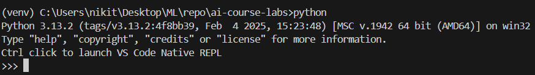
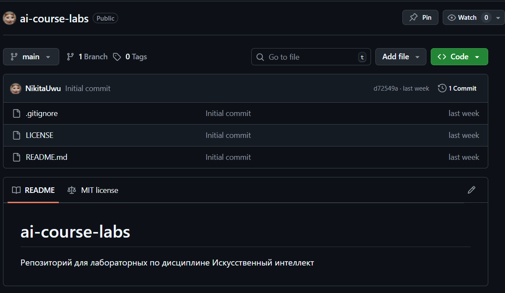
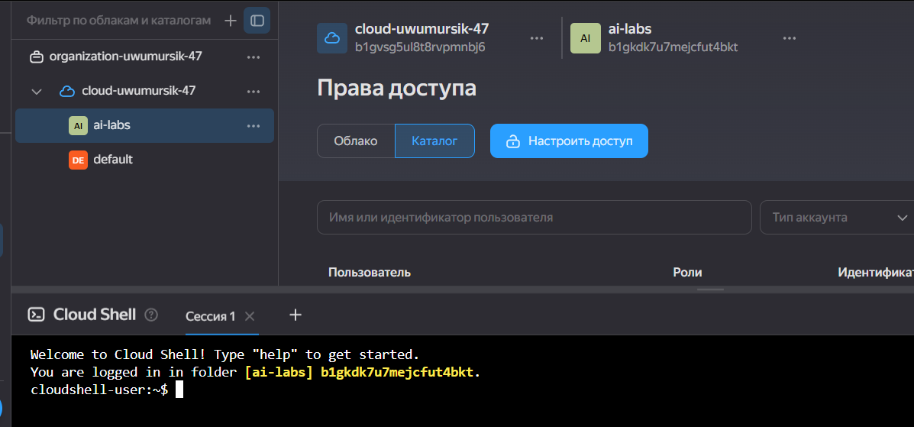
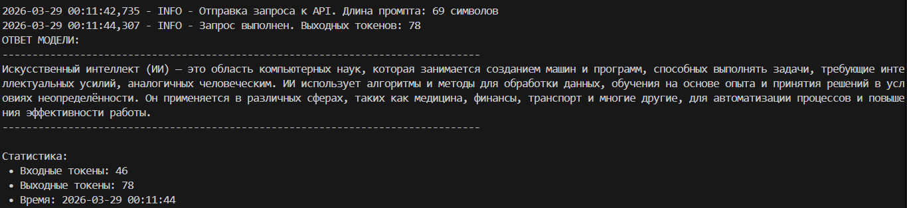
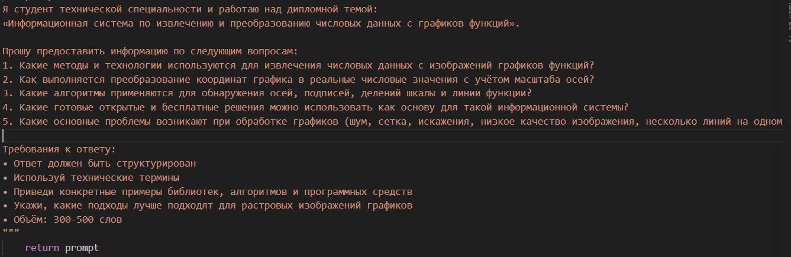
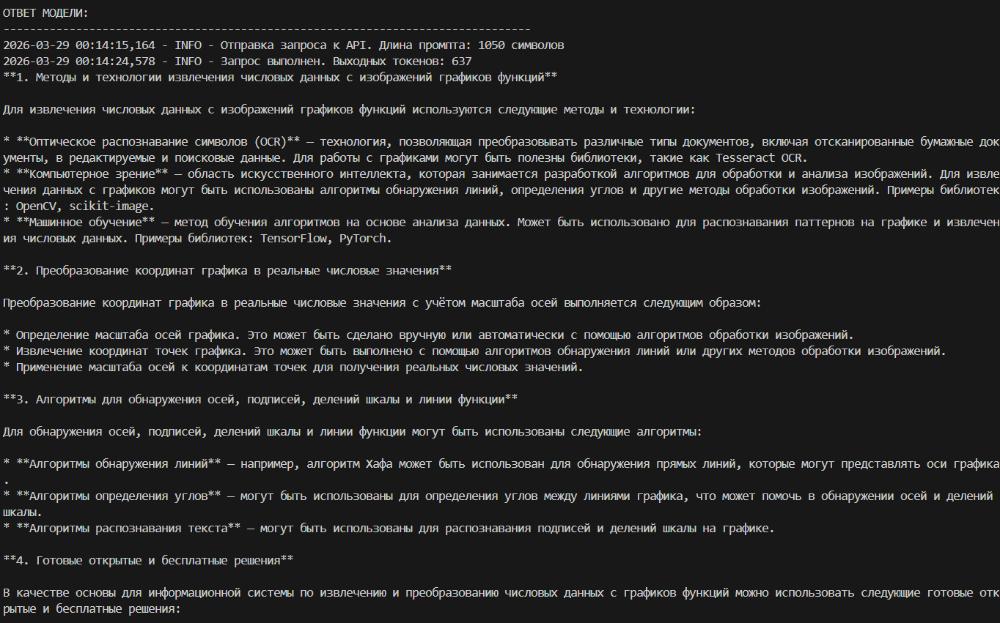

# Отчёт по лабораторной работе №1
## Дисциплина: Искусственный интеллект
---
## Общая информация
| Параметр | Значение |
|----------|----------|
| **Студент** | Жданов Никита Валерьевич |
| **Группа** | ФИТ-221 |
| **Дата выполнения** | 28.03.26 |
| **Специальность** | Фундаментальная информатика и информационные технологии |
| **Тема диплома** | Информационная система распознавания данных с технических графиков |
---
## 1. Цель работы
Познакомиться на практике с агентным ии на примере YandexGPT.
Зарегистрироваться на сервисе Yandex Cloud, произвести базовую настройку агента и выполнить индивидуальный запрос.
---
## 2. Выполненные задачи
- [ ] Настроено окружение Python 3.10+
- [ ] Создан GitHub-репозиторий
- [ ] Получены API-ключи Yandex Cloud
- [ ] Реализован базовый вызов API
- [ ] Выполнен адаптированный запрос
---
## 3. Ход работы
### 3.1. Настройка окружения

/```bash
# Команды установки
python --version
pip install -r requirements.txt
/```
### 3.2. Создание репозитория

- URL репозитория: `https://github.com/NikitaUwu/ai-course-labs`
- Текущая ветка: `week1`
### 3.3. Получение API-ключей

- Cloud ID: `b1gvsg5ul8t8rvpmnbj6`
- Folder ID: `b1gkdk7u7mejcfut4bkt`
### 3.4. Тестовый запрос
**Запрос:**
/```
Объясни кратко, что такое искусственный интеллект
/```
**Ответ:**
/```

/```
[Скриншот выполнения скрипта]
### 3.5. Адаптированный запрос
**Специальность:** Фундаментальная информатика и информационные технологии
**Запрос:**
/```

/```
**Ответ:**
/```
**1. Методы и технологии извлечения числовых данных с изображений графиков функций:**

* **Оптическое распознавание символов (OCR)**: используется для распознавания текста на графике, включая подписи осей и деления шкалы.
* **Компьютерное зрение**: применяется для обнаружения и анализа графических элементов, таких как линии, оси и деления шкалы.
* **Машинное обучение**: может использоваться для классификации и сегментации графических элементов.

**2. Преобразование координат графика в реальные числовые значения:**

* Определение масштаба осей: необходимо определить масштаб по осям X и Y, чтобы преобразовать координаты графика в реальные числовые значения.
* Учёт искажений: если график имеет искажения, необходимо учесть их при преобразовании координат.
* Аффинное преобразование: может использоваться для преобразования координат графика в систему координат с учётом масштаба осей.

**3. Алгоритмы для обнаружения осей, подписей, делений шкалы и линии функции:**

* **Обнаружение границ**: алгоритмы обнаружения границ могут использоваться для нахождения линий графика и осей.
* **Сегментация изображений**: методы сегментации изображений могут быть применены для разделения графика на отдельные элементы, такие как оси, деления шкалы и линия функции.
* **Распознавание образов**: алгоритмы распознавания образов могут использоваться для идентификации подписей осей и делений шкалы.

**4. Готовые открытые и бесплатные решения:**

* **OpenCV**: библиотека компьютерного зрения, которая может быть использована для обнаружения и анализа графических элементов.
* **MATLAB**: программное обеспечение для научных вычислений, которое имеет функции для обработки изображений и извлечения данных.
* **Python-библиотеки**: библиотеки Python, такие как NumPy, SciPy и Matplotlib, могут быть использованы для анализа и визуализации данных.

**5. Основные проблемы при обработке графиков и их решения:**

* **Шум**: может быть уменьшен с помощью фильтров и методов шумоподавления.
* **Сетка**: может быть удалена с помощью алгоритмов сегментации и удаления фона.
* **Искажения**: могут быть учтены при преобразовании координат графика.
* **Низкое качество изображения**: может быть улучшено с помощью методов повышения качества изображения.
* **Несколько линий на одном графике**: могут быть разделены с помощью алгоритмов сегментации и кластеризации.
--------------------------------------------------------------------------------

Токены: вход=234, выход=459
/```

---
## 4. Результаты
| Критерий | Статус |
|----------|--------|
| Окружение настроено | ✅ |
| Репозиторий создан | ✅ |
| Ветка week1 создана | ✅ |
| API работает | ✅ |
| Адаптация выполнена | ✅ |
---
## 5. Выводы
Изучил основы работы с ии агентами, в частности с YandexGPT. Были некоторые трудности с интерфейсом Yandex Cloud.
---
## 6. Список источников
1. Yandex Cloud Documentation. URL: https://cloud.yandex.ru/docs/
2. LangChain Documentation. URL: https://python.langchain.com/
3. GitHub Documentation. URL: https://docs.github.com/