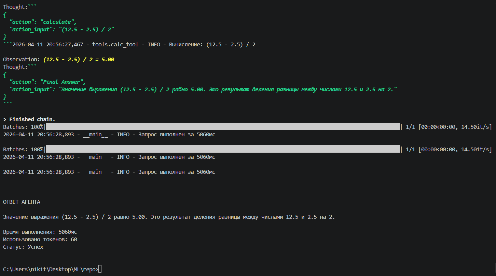
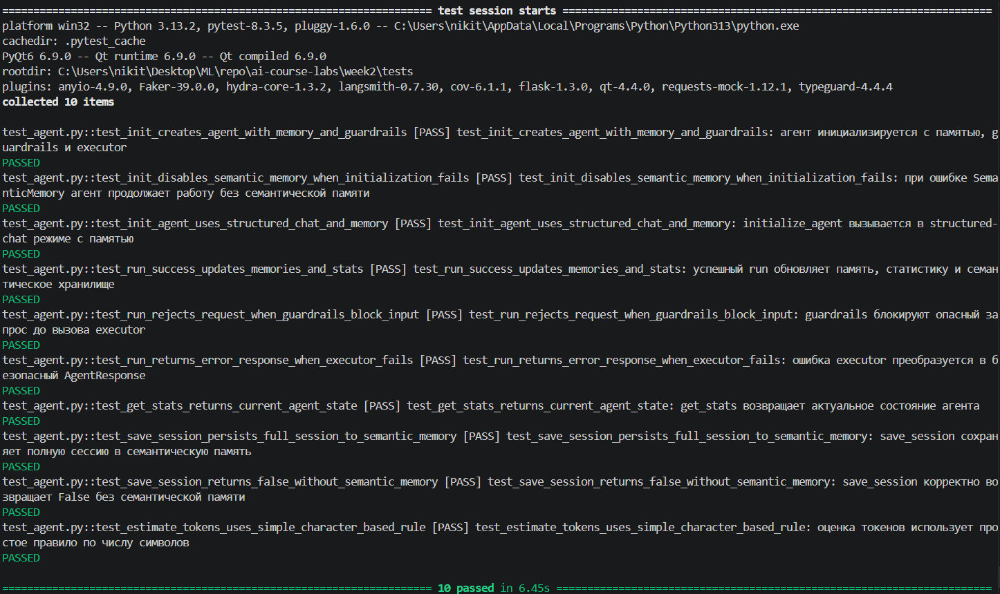

# Отчёт по лабораторной работе №2
## Дисциплина: Искусственный интеллект
---
## Общая информация
| Параметр | Значение |
|----------|----------|
| **Студент** | Жданов Никита Валерьевич |
| **Группа** | ФИТ-221 |
| **Специальность** | Фундаментальная информатика и информационные технологии |
| **Тема диплома** | Информационная система по извлечению и преобразованию числовых данных с графиков функций |
---
## 1. Цель работы
Разработать прототип AI-агента на базе LangChain с поддержкой инструментов, памяти и базовых guardrails, а также адаптировать его под тему дипломной работы.  
Практическая цель лабораторной работы состояла в том, чтобы объединить YandexGPT, набор прикладных инструментов и механизмы хранения контекста в одном приложении, которое может использоваться как основа для дальнейшей разработки информационной системы анализа графиков функций.
---
## 2. Выполненные задачи
- [x] Реализовано ядро агента на LangChain
- [x] Создано минимум 2 инструмента
- [x] Реализован кастомный инструмент для специальности
- [x] Подключена семантическая память (ChromaDB)
- [x] Реализованы guardrails
- [x] Написаны тесты
---
## 3. Ход работы
### 3.1. Архитектура агента
В рамках лабораторной работы был реализован класс `AIAgent`, который объединяет языковую модель, инструменты, память и защитные механизмы. В качестве LLM используется `YandexGPT`, подключаемый через `langchain_community.llms`. Для управления вызовом инструментов применяется инициализация LangChain-агента через `initialize_agent(...)` в режиме `STRUCTURED_CHAT_ZERO_SHOT_REACT_DESCRIPTION`, так как используемые инструменты имеют несколько входных параметров.

Архитектура решения включает следующие основные компоненты:

1. **Ядро агента (`agent_core.py`)**
   Отвечает за инициализацию конфигурации, LLM, списка инструментов, памяти, guardrails и формирование итогового ответа в виде структуры `AgentResponse`.

2. **Слой инструментов (`src/tools`)**
   Содержит отдельные специализированные инструменты для поиска, вычислений и обработки точек графика. Каждый инструмент оформлен как класс-наследник `BaseTool`.

3. **Слой памяти (`src/memory`)**
   - `WorkingMemory` хранит краткосрочную историю диалога в оперативном виде;
   - `SemanticMemory` использует ChromaDB для долговременного хранения и семантического поиска по взаимодействиям.

4. **Слой безопасности (`src/guardrails`)**
   Модуль `InputGuardrails` выполняет первичную проверку пользовательского ввода: ограничение длины, поиск опасных шаблонов, базовая фильтрация попыток инъекций.

5. **Слой логирования и статистики**
   Агент ведёт логирование через `logging`, сохраняет время обработки запроса, приблизительную оценку числа токенов и количество обращений.

Общая логика работы выглядит следующим образом:

`Запрос пользователя -> InputGuardrails -> LangChain-агент -> вызов нужного инструмента -> формирование ответа -> сохранение в память -> возврат AgentResponse`

Дополнительно в процессе настройки были устранены проблемы совместимости с `Pydantic v2`, конфигурацией семантической памяти ChromaDB и типом LangChain-агента для multi-input tools.

### 3.2. Реализованные инструменты
| Инструмент | Назначение | Параметры |
|-----------|-----------|-----------|
| `search_web` | Учебный инструмент поиска информации. В текущей версии возвращает mock-результаты и может быть заменён на реальный поисковый API. | `query`, `num_results` |
| `calculate` | Безопасное выполнение математических выражений без использования `eval()`. | `expression`, `precision` |
| `transform_graph_points` | Преобразование извлечённых с графика пиксельных координат в числовые значения осей и краткий анализ результата. | `points_text`, `x_origin`, `y_origin`, `x_scale`, `y_scale`, `precision`, `output_mode` |

### 3.3. Кастомный инструмент
Кастомный инструмент был адаптирован под тему дипломной работы. Его основная задача состоит в том, чтобы принять уже извлечённые с изображения координаты точек графика, перевести их из пиксельной системы координат в числовую систему осей и подготовить результат для дальнейшего анализа.

Практическая ценность инструмента заключается в следующем:

- он закрывает этап **преобразования данных** после извлечения точек с изображения;
- поддерживает работу с масштабом осей и точкой начала координат;
- формирует результат в удобном виде: краткое summary, таблица или CSV;
- выполняет простую дополнительную проверку данных: сортировку по `X`, определение общего характера изменения функции и поиск повторяющихся `X` со значениями разных `Y`.

Преобразование выполняется по формулам:

- `x_value = (x_pixel - x_origin) * x_scale`
- `y_value = (y_origin - y_pixel) * y_scale`

Такая схема соответствует типичной обработке графиков на изображениях, где ось `Y` в пиксельной системе направлена вниз.

Ключевой фрагмент кода инструмента:

```python
class CustomTool(BaseTool):
    name: str = "transform_graph_points"

    def _run(
        self,
        points_text: str,
        x_origin: float = 0.0,
        y_origin: float = 0.0,
        x_scale: float = 1.0,
        y_scale: float = 1.0,
        precision: int = 3,
        output_mode: str = "summary",
    ) -> str:
        pixel_points = self._parse_points(points_text)
        rows = self._transform_points(
            pixel_points=pixel_points,
            x_origin=x_origin,
            y_origin=y_origin,
            x_scale=x_scale,
            y_scale=y_scale,
        )
        return self._build_summary(
            rows=rows,
            precision=precision,
            x_origin=x_origin,
            y_origin=y_origin,
            x_scale=x_scale,
            y_scale=y_scale,
        )
```

Фактически данный инструмент является упрощённым прототипом модуля преобразования числовых данных, который может использоваться в дипломной системе после этапов компьютерного зрения, OCR и выделения линии функции.

**Пример использования и результат работы инструмента заполняются вручную по итогам демонстрации.**

### 3.4. Тестирование
Для проверки проекта были выполнены два вида тестирования:

1. **Демонстрационное тестирование через `agent_core.py`**
   В точке входа `__main__` была добавлена последовательная демонстрация всех реализованных инструментов:
   - `search_web`
   - `calculate`
   - `transform_graph_points`

   После отдельной демонстрации каждого инструмента выполняется интеграционный запуск самого агента.

2. **Unit-тестирование через `tests/test_agent.py`**
   Для модуля `agent_core.py` был подготовлен набор unit-тестов, проверяющих:
   - успешную инициализацию агента;
   - fallback при ошибке инициализации семантической памяти;
   - корректную настройку LangChain-агента;
   - успешную обработку запроса и обновление памяти;
   - блокировку опасного ввода guardrails;
   - корректную обработку ошибок executor;
   - формирование статистики;
   - сохранение сессии в семантическую память;
   - оценку количества токенов.

Вывод
```
================================================================================
ЛАБОРАТОРНАЯ РАБОТА №2
Демонстрация AI-агента, инструментов и памяти
================================================================================

ДЕМОНСТРАЦИЯ ИНСТРУМЕНТОВ
================================================================================

[1] Инструмент search_web
--------------------------------------------------------------------------------
2026-04-11 20:56:12,448 - tools.search_tool - INFO - Поиск: извлечение числовых данных с графиков функций (результатов: 3)
Поиск по запросу: извлечение числовых данных с графиков функций

Результат 1: Информация по запросу 'извлечение числовых данных с графиков функций',
            Источник: Открытые данные,
            Актуальность: 2026
Результат 2: Информация по запросу 'извлечение числовых данных с графиков функций',
            Источник: Открытые данные,
            Актуальность: 2026
Результат 3: Информация по запросу 'извлечение числовых данных с графиков функций',
            Источник: Открытые данные,
            Актуальность: 2026

[2] Инструмент calculate
--------------------------------------------------------------------------------
2026-04-11 20:56:12,450 - tools.calc_tool - INFO - Вычисление: (12.5 - 2.5) / 2
(12.5 - 2.5) / 2 = 5.00

[3] Инструмент transform_graph_points
--------------------------------------------------------------------------------
2026-04-11 20:56:12,450 - tools.custom_tool - INFO - Вызов transform_graph_points: x_origin=120, y_origin=400, x_scale=0.05, y_scale=0.1
Преобразование точек графика выполнено.
Количество точек: 4
Параметры преобразования: x_origin=120, y_origin=400, x_scale=0.05, y_scale=0.1
Диапазон X: 0 .. 9
Диапазон Y: 6 .. 18
Характер изменения Y при росте X: монотонно возрастает
Проверка на корректность как функции: дубликатов X с разными Y не обнаружено

Первые точки после сортировки по X:
index | x_pixel | y_pixel | x_value | y_value
---------------------------------------------
1 | 120 | 340 | 0 | 6
2 | 180 | 300 | 3 | 10
3 | 240 | 260 | 6 | 14
4 | 300 | 220 | 9 | 18

================================================================================
ИНТЕГРАЦИОННЫЙ ЗАПУСК АГЕНТА
================================================================================
2026-04-11 20:56:12,452 - __main__ - INFO - Инициализация агента: TechnicalAssistant v2.0
2026-04-11 20:56:12,463 - __main__ - INFO - LLM инициализирован
2026-04-11 20:56:12,464 - __main__ - INFO - Доступно инструментов: 3
2026-04-11 20:56:17,631 - sentence_transformers.base.model - INFO - Loading SentenceTransformer model from sentence-transformers/paraphrase-multilingual-MiniLM-L12-v2.
2026-04-11 20:56:23,826 - memory.semantic_memory - INFO - Using local SentenceTransformer embedding model: sentence-transformers/paraphrase-multilingual-MiniLM-L12-v2
2026-04-11 20:56:23,828 - memory.semantic_memory - INFO - Семантическая память инициализирована: agent_knowledge
2026-04-11 20:56:23,828 - __main__ - INFO - Память активирована
2026-04-11 20:56:23,828 - __main__ - INFO - Guardrails активированы
c:\Users\nikit\Desktop\ML\repo\ai-course-labs\week2\src\agent_core.py:185: LangChainDeprecationWarning: Please see the migration guide at: https://python.langchain.com/docs/versions/migrating_memory/
  memory = ConversationBufferMemory(
c:\Users\nikit\Desktop\ML\repo\ai-course-labs\week2\src\agent_core.py:190: LangChainDeprecationWarning: LangChain agents will continue to be supported, but it is recommended for new use cases to be built with LangGraph. LangGraph offers a more flexible and full-featured framework for building agents, including support 
for tool-calling, persistence of state, and human-in-the-loop workflows. For details, refer to the `LangGraph documentation <https://langchain-ai.github.io/langgraph/>`_ as well as guides for `Migrating from AgentExecutor <https://python.langchain.com/docs/how_to/migrate_agent/>`_ and LangGraph's `Pre-built ReAct agent <https://langchain-ai.github.io/langgraph/how-tos/create-react-agent/>`_.
  return initialize_agent(
2026-04-11 20:56:23,832 - __main__ - INFO - Агент готов к работе

Запрос: Найди краткую информацию о методах извлечения данных с графиков, затем вычисли значение выражения (12.5 - 2.5) / 2 и поясни результат.

2026-04-11 20:56:23,833 - __main__ - INFO - Обработка запроса: Найди краткую информацию о методах извлечения данных с графиков, затем вычисли значение выражения (1...
c:\Users\nikit\Desktop\ML\repo\ai-course-labs\week2\src\agent_core.py:228: LangChainDeprecationWarning: The method `Chain.run` was deprecated in langchain 0.1.0 and will be removed in 1.0. Use :meth:`~invoke` instead.
  result = self.agent.run(query)


> Entering new AgentExecutor chain...

{
  "action": "search_web",
  "action_input": "методы извлечения данных с графиков"
}


2026-04-11 20:56:26,578 - tools.search_tool - INFO - Поиск: методы извлечения данных с графиков (результатов: 5)

Observation: Поиск по запросу: методы извлечения данных с графиков

Результат 1: Информация по запросу 'методы извлечения данных с графиков',
            Источник: Открытые данные,
            Актуальность: 2026
Результат 2: Информация по запросу 'методы извлечения данных с графиков',
            Источник: Открытые данные,
            Актуальность: 2026
Результат 3: Информация по запросу 'методы извлечения данных с графиков',
            Источник: Открытые данные,
            Актуальность: 2026
Результат 4: Информация по запросу 'методы извлечения данных с графиков',
            Источник: Открытые данные,
            Актуальность: 2026
Результат 5: Информация по запросу 'методы извлечения данных с графиков',
            Источник: Открытые данные,
            Актуальность: 2026
Thought:
{
  "action": "calculate",
  "action_input": "(12.5 - 2.5) / 2"
}
2026-04-11 20:56:27,467 - tools.calc_tool - INFO - Вычисление: (12.5 - 2.5) / 2

Observation: (12.5 - 2.5) / 2 = 5.00
Thought:
{
  "action": "Final Answer",
  "action_input": "Значение выражения (12.5 - 2.5) / 2 равно 5.00. Это результат деления разницы между числами 12.5 и 2.5 на 2."
}


> Finished chain.
Batches: 100%|███████████████████████████████████████████████████████████████████████████████████████████████████████████████████| 1/1 [00:00<00:00, 14.50it/s] 
2026-04-11 20:56:28,893 - __main__ - INFO - Запрос выполнен за 5060мс

================================================================================
ОТВЕТ АГЕНТА
================================================================================
Значение выражения (12.5 - 2.5) / 2 равно 5.00. Это результат деления разницы между числами 12.5 и 2.5 на 2.
================================================================================
Время выполнения: 5060мс
Использовано токенов: 60
Статус: Успех
================================================================================
```
Скриншоты:



Пример запуска unit-тестов:

```bash
py -m pytest tests\test_agent.py -v -s
```

При запуске тестов в консоль выводятся сообщения о прохождении каждого тестового сценария, что упрощает демонстрацию и проверку результата.

### 3.5. Интеграция с дипломом
Результаты лабораторной работы напрямую связаны с тематикой дипломного проекта. Созданный агент может рассматриваться как интеллектуальный слой будущей информационной системы по извлечению и преобразованию числовых данных с графиков функций.

Связь с дипломом выражается в следующих аспектах:

1. **Интеллектуальный интерфейс**
   Агент может использоваться как надстройка над системой обработки графиков, принимая текстовые запросы пользователя и управляя отдельными сервисами.

2. **Преобразование извлечённых координат**
   Кастомный инструмент `transform_graph_points` моделирует один из ключевых этапов дипломной системы: перевод пиксельных координат в реальные числовые значения по шкалам осей.

3. **Поддержка анализа результатов**
   После преобразования данных агент может выдавать интерпретацию: диапазон значений, характер изменения функции, возможные ошибки в извлечённых точках.

4. **Хранение взаимодействий и контекста**
   Семантическая память на основе ChromaDB может быть использована для хранения типовых сценариев обработки, результатов экспериментов и накопления контекста по сериям запросов.

5. **Безопасность пользовательского взаимодействия**
   Guardrails позволяют ограничивать потенциально опасные запросы и тем самым делают систему более устойчивой при использовании в учебной или демонстрационной среде.

В дальнейшем данная лабораторная работа может быть расширена добавлением модуля компьютерного зрения, OCR для считывания подписей осей и автоматического выделения точек линии функции на изображении.
---
## 4. Результаты
| Критерий | Статус |
|----------|--------|
| Ядро агента реализовано | ✅ |
| Инструменты созданы | ✅ |
| Кастомный инструмент адаптирован под дипломную тему | ✅ |
| Память подключена | ✅ |
| Guardrails реализованы | ✅ |
| Автоматизированные тесты написаны | ✅ |
| Демонстрация всех инструментов выполнена | ✅ |
| Интеграционный запуск агента выполнен | ✅ |
| Код в GitHub | ✅ |
---
## 5. Выводы
В ходе выполнения лабораторной работы был разработан прототип AI-агента с поддержкой LangChain, набора инструментов, краткосрочной и семантической памяти, а также базовых guardrails. Отдельное внимание было уделено адаптации решения под предметную область дипломной работы, связанной с обработкой графиков функций и преобразованием координат в числовые данные.

Практически полезным результатом стала реализация кастомного инструмента `transform_graph_points`, который может использоваться как часть будущей системы извлечения данных с графиков. Также были изучены особенности интеграции YandexGPT, ChromaDB и LangChain в одном приложении.

В процессе работы возникли технические трудности, связанные с:

- совместимостью `BaseTool` и `Pydantic v2`;
- инициализацией семантической памяти и embedding-функций ChromaDB;
- выбором подходящего типа LangChain-агента для multi-input tools;
- настройкой зависимостей в среде Windows/Python 3.13.

---
## 6. Список источников
1. LangChain Documentation. URL: https://python.langchain.com/docs/introduction/
2. Chroma Documentation. URL: https://docs.trychroma.com/
3. Yandex Cloud Foundation Models Documentation. URL: https://cloud.yandex.ru/docs/foundation-models/
4. Pydantic Documentation. URL: https://docs.pydantic.dev/
5. Sentence Transformers Documentation. URL: https://sbert.net/
