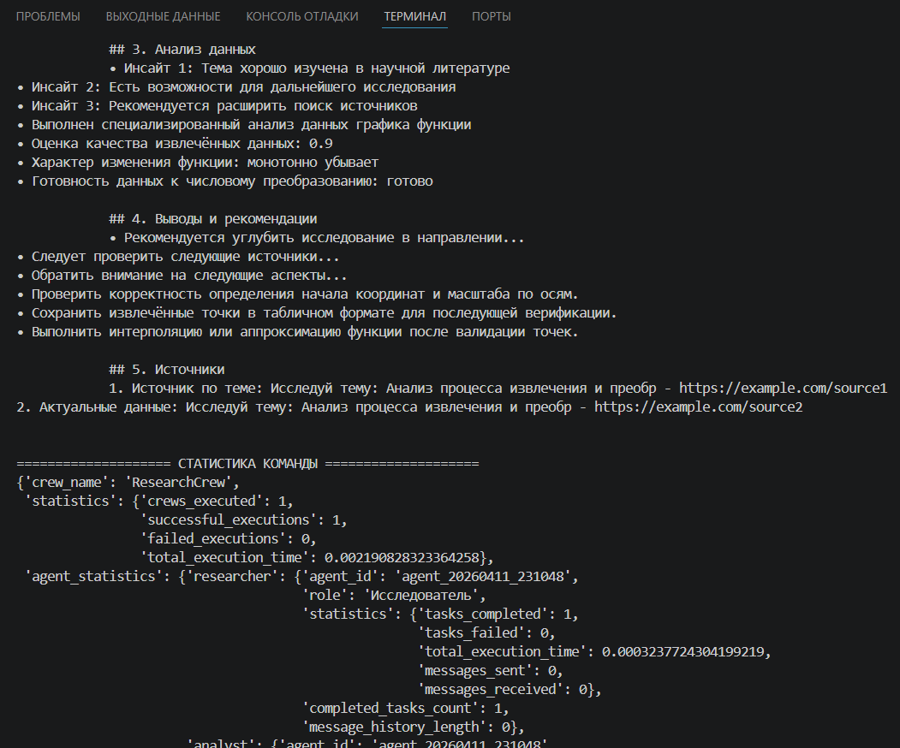
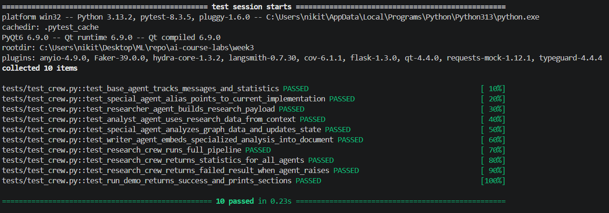
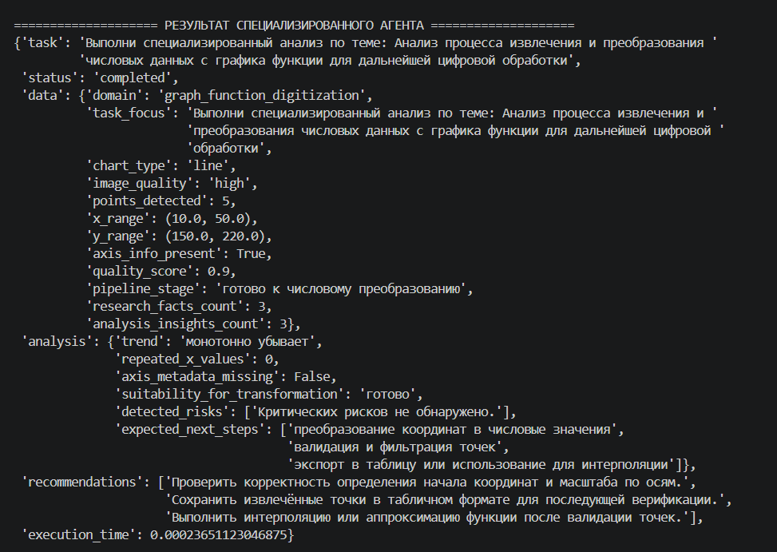

# Отчёт по лабораторной работе №3
## Дисциплина: Искусственный интеллект
---
## Общая информация
| Параметр | Значение |
|----------|----------|
| **Студент** | Жданов Никита Валерьевич |
| **Группа** | ФИТ-221 |
| **Дата выполнения** | 11.04.2026 |
| **Специальность** | Фундаментальная информатика и информационные технологии |
| **Тема диплома** | Информационная система по извлечению и преобразованию числовых данных с графиков функций |
---
## 1. Цель работы
Целью лабораторной работы являлось изучение принципов построения Multi-Agent System (MAS) и разработка собственной многоагентной системы, в которой отдельные агенты выполняют различные роли в общем процессе обработки информации. Дополнительной целью была адаптация одного из агентов под предметную область дипломной работы, связанную с извлечением и преобразованием числовых данных с графиков функций.
---
## 2. Выполненные задачи
- [x] Изучены архитектурные паттерны MAS
- [x] Реализовано минимум 3 агента
- [x] Создана команда агентов (Crew)
- [x] Реализована специализация под диплом
- [x] Написаны тесты
- [x] Код загружен в GitHub
---
## 3. Ход работы
### 3.1. Архитектура Multi-Agent системы
В рамках лабораторной работы была реализована последовательная многоагентная архитектура, в которой каждый агент отвечает за собственный этап обработки данных.

Текстовая схема архитектуры:

`ResearcherAgent -> AnalystAgent -> SpecialAgent -> WriterAgent`

Основу системы составляет базовый класс `BaseAgent`, который предоставляет:
- единый интерфейс для выполнения задач;
- хранение состояния агента;
- ведение статистики;
- обмен сообщениями между агентами.

Координация между агентами реализована в классе `ResearchCrew`. Он отвечает за:
- создание экземпляров агентов;
- последовательный запуск этапов обработки;
- передачу промежуточных результатов через общий контекст;
- сбор итогового результата и общей статистики.

Такая архитектура удобна тем, что позволяет разделить общую задачу на независимые роли и при необходимости расширять систему новыми специализированными агентами.

### 3.2. Реализованные агенты
| Агент | Роль | Назначение |
|-------|------|-----------|
| ResearcherAgent | Исследователь | Сбор информации и выделение ключевых фактов |
| AnalystAgent | Аналитик | Структурирование данных, поиск паттернов и расчёт метрик |
| WriterAgent | Писатель | Формирование итогового структурированного отчёта |
| SpecialAgent | Специалист по обработке графиков | Предметно-ориентированный анализ данных, извлечённых с графиков функций |

### 3.3. Специализированный агент
Для адаптации системы под тему дипломной работы был реализован `SpecialAgent`. Этот агент ориентирован на обработку результатов цифровизации графиков функций и используется как промежуточный интеллектуальный модуль между аналитиком и агентом-писателем.

Назначение специализированного агента:
- анализировать извлечённые точки графика;
- оценивать качество набора данных;
- определять диапазоны значений по осям;
- выявлять риски дальнейшей обработки;
- формировать рекомендации по переходу от графического представления к числовым данным.

На вход агент получает контекст, в котором могут присутствовать:
- тип графика (`chart_type`);
- качество изображения (`image_quality`);
- информация об осях (`axis_info`);
- набор извлечённых точек (`graph_points`);
- результаты предыдущих агентов (`research_data`, `analysis_data`).

На выходе агент формирует:
- блок обработанных предметных данных;
- аналитический вывод по качеству и пригодности данных;
- список рекомендаций для дальнейшего преобразования и использования в дипломной системе.

Ключевой фрагмент реализации:

```python
class SpecialAgent(BaseAgent):
    def execute_task(self, task_description: str, context: Optional[Dict] = None) -> Dict:
        processed_data = self._process_specialty_data(task_description, context)
        analysis = self._perform_analysis(task_description, context)
        recommendations = self._generate_recommendations(task_description, context)

        return {
            "task": task_description,
            "status": "completed",
            "data": processed_data,
            "analysis": analysis,
            "recommendations": recommendations,
        }
```

Благодаря такой структуре `SpecialAgent` не дублирует функции остальных агентов, а добавляет именно предметную логику, связанную с тематикой дипломной работы.

Пример использования:

```
==================== ЗАДАЧА ====================
Анализ процесса извлечения и преобразования числовых данных с графика функции для дальнейшей цифровой обработки

==================== ВХОДНОЙ КОНТЕКСТ ====================
{'chart_type': 'line',
 'image_quality': 'high',
 'axis_info': {'x_scale': 0.1, 'y_scale': 0.2, 'origin': (0, 240)},
 'graph_points': [(10, 220), (20, 200), (30, 185), (40, 168), (50, 150)],
 'research_data': {'task': 'Исследуй тему: Анализ процесса извлечения и преобразования числовых '
                           'данных с графика функции для дальнейшей цифровой обработки',
                   'status': 'completed',
                   'sources_found': [{'title': 'Источник по теме: Исследуй тему: Анализ процесса '
                                               'извлечения и преобр',
                                      'type': 'academic',
                                      'relevance': 0.85,
                                      'url': 'https://example.com/source1'},
                                     {'title': 'Актуальные данные: Исследуй тему: Анализ процесса '
                                               'извлечения и преобр',
                                      'type': 'news',
                                      'relevance': 0.72,
                                      'url': 'https://example.com/source2'}],
                   'key_facts': ['Ключевой факт 1 по теме: Исследуй тему: Анализ процесса',
                                 'Ключевой факт 2 по теме: Исследуй тему: Анализ процесса',
                                 'Ключевой факт 3 по теме: Исследуй тему: Анализ процесса'],
                   'recommendations': ['Рекомендуется углубить исследование в направлении...',
                                       'Следует проверить следующие источники...',
                                       'Обратить внимание на следующие аспекты...'],
                   'execution_time': 0.0003237724304199219},
 'analysis_data': {'task': 'Проанализируй данные по теме: Анализ процесса извлечения и '
                           'преобразования числовых данных с графика функции для дальнейшей '
                           'цифровой обработки',
                   'status': 'completed',
                   'structured_data': {'sources_count': 2,
                                       'facts_count': 3,
                                       'data_quality': 'high',
                                       'completeness': 0.85},
                   'patterns_identified': ['Паттерн 1: Преобладание академических источников',
                                           'Паттерн 2: Высокая релевантность найденных материалов',
                                           'Паттерн 3: Консистентность ключевых фактов'],
                   'insights': ['Инсайт 1: Тема хорошо изучена в научной литературе',
                                'Инсайт 2: Есть возможности для дальнейшего исследования',
                                'Инсайт 3: Рекомендуется расширить поиск источников'],
                   'metrics': {'data_quality_score': 0.87,
                               'coverage_score': 0.75,
                               'reliability_score': 0.92},
                   'execution_time': 0.00021576881408691406},
 'special_data': {'task': 'Выполни специализированный анализ по теме: Анализ процесса извлечения и '
                          'преобразования числовых данных с графика функции для дальнейшей '
                          'цифровой обработки',
                  'status': 'completed',
                  'data': {'domain': 'graph_function_digitization',
                           'task_focus': 'Выполни специализированный анализ по теме: Анализ '
                                         'процесса извлечения и преобразования числовых данных с '
                                         'графика функции для дальнейшей цифровой обработки',
                           'chart_type': 'line',
                           'image_quality': 'high',
                           'points_detected': 5,
                           'x_range': (10.0, 50.0),
                           'y_range': (150.0, 220.0),
                           'axis_info_present': True,
                           'quality_score': 0.9,
                           'pipeline_stage': 'готово к числовому преобразованию',
                           'research_facts_count': 3,
                           'analysis_insights_count': 3},
                  'analysis': {'trend': 'монотонно убывает',
                               'repeated_x_values': 0,
                               'axis_metadata_missing': False,
                               'suitability_for_transformation': 'готово',
                               'detected_risks': ['Критических рисков не обнаружено.'],
                               'expected_next_steps': ['преобразование координат в числовые '
                                                       'значения',
                                                       'валидация и фильтрация точек',
                                                       'экспорт в таблицу или использование для '
                                                       'интерполяции']},
                  'recommendations': ['Проверить корректность определения начала координат и '
                                      'масштаба по осям.',
                                      'Сохранить извлечённые точки в табличном формате для '
                                      'последующей верификации.',
                                      'Выполнить интерполяцию или аппроксимацию функции после '
                                      'валидации точек.'],
                  'execution_time': 0.00023651123046875}}

==================== РЕЗУЛЬТАТ ИССЛЕДОВАТЕЛЯ ====================
{'task': 'Исследуй тему: Анализ процесса извлечения и преобразования числовых данных с графика '
         'функции для дальнейшей цифровой обработки',
 'status': 'completed',
 'sources_found': [{'title': 'Источник по теме: Исследуй тему: Анализ процесса извлечения и преобр',
                    'type': 'academic',
                    'relevance': 0.85,
                    'url': 'https://example.com/source1'},
                   {'title': 'Актуальные данные: Исследуй тему: Анализ процесса извлечения и '
                             'преобр',
                    'type': 'news',
                    'relevance': 0.72,
                    'url': 'https://example.com/source2'}],
 'key_facts': ['Ключевой факт 1 по теме: Исследуй тему: Анализ процесса',
               'Ключевой факт 2 по теме: Исследуй тему: Анализ процесса',
               'Ключевой факт 3 по теме: Исследуй тему: Анализ процесса'],
 'recommendations': ['Рекомендуется углубить исследование в направлении...',
                     'Следует проверить следующие источники...',
                     'Обратить внимание на следующие аспекты...'],
 'execution_time': 0.0003237724304199219}

==================== РЕЗУЛЬТАТ АНАЛИТИКА ====================
{'task': 'Проанализируй данные по теме: Анализ процесса извлечения и преобразования числовых '
         'данных с графика функции для дальнейшей цифровой обработки',
 'status': 'completed',
 'structured_data': {'sources_count': 2,
                     'facts_count': 3,
                     'data_quality': 'high',
                     'completeness': 0.85},
 'patterns_identified': ['Паттерн 1: Преобладание академических источников',
                         'Паттерн 2: Высокая релевантность найденных материалов',
                         'Паттерн 3: Консистентность ключевых фактов'],
 'insights': ['Инсайт 1: Тема хорошо изучена в научной литературе',
              'Инсайт 2: Есть возможности для дальнейшего исследования',
              'Инсайт 3: Рекомендуется расширить поиск источников'],
 'metrics': {'data_quality_score': 0.87, 'coverage_score': 0.75, 'reliability_score': 0.92},
 'execution_time': 0.00021576881408691406}

==================== РЕЗУЛЬТАТ СПЕЦИАЛИЗИРОВАННОГО АГЕНТА ====================
{'task': 'Выполни специализированный анализ по теме: Анализ процесса извлечения и преобразования '
         'числовых данных с графика функции для дальнейшей цифровой обработки',
 'status': 'completed',
 'data': {'domain': 'graph_function_digitization',
          'task_focus': 'Выполни специализированный анализ по теме: Анализ процесса извлечения и '
                        'преобразования числовых данных с графика функции для дальнейшей цифровой '
                        'обработки',
          'chart_type': 'line',
          'image_quality': 'high',
          'points_detected': 5,
          'x_range': (10.0, 50.0),
          'y_range': (150.0, 220.0),
          'axis_info_present': True,
          'quality_score': 0.9,
          'pipeline_stage': 'готово к числовому преобразованию',
          'research_facts_count': 3,
          'analysis_insights_count': 3},
 'analysis': {'trend': 'монотонно убывает',
              'repeated_x_values': 0,
              'axis_metadata_missing': False,
              'suitability_for_transformation': 'готово',
              'detected_risks': ['Критических рисков не обнаружено.'],
              'expected_next_steps': ['преобразование координат в числовые значения',
                                      'валидация и фильтрация точек',
                                      'экспорт в таблицу или использование для интерполяции']},
 'recommendations': ['Проверить корректность определения начала координат и масштаба по осям.',
                     'Сохранить извлечённые точки в табличном формате для последующей верификации.',
                     'Выполнить интерполяцию или аппроксимацию функции после валидации точек.'],
 'execution_time': 0.00023651123046875}

==================== ИТОГОВЫЙ ОТЧЁТ ПИСАТЕЛЯ ====================

            # Отчёт по теме: Создай отчёт по теме: Анализ процесса извлечения и преобразования числовых данных с графика функции для дальнейшей цифровой обработки
            ## 1. Введение
            Данный отчёт посвящён исследованию темы: Создай отчёт по теме: Анализ процесса извлечения и преобразования числовых данных с графика функции для дальнейшей цифровой обработки. В работе представлены результаты комплексного анализа...

            ## 2. Основные findings
            • Ключевой факт 1 по теме: Исследуй тему: Анализ процесса
• Ключевой факт 2 по теме: Исследуй тему: Анализ процесса
• Ключевой факт 3 по теме: Исследуй тему: Анализ процесса

            ## 3. Анализ данных
            • Инсайт 1: Тема хорошо изучена в научной литературе
• Инсайт 2: Есть возможности для дальнейшего исследования
• Инсайт 3: Рекомендуется расширить поиск источников
• Выполнен специализированный анализ данных графика функции
• Оценка качества извлечённых данных: 0.9
• Характер изменения функции: монотонно убывает
• Готовность данных к числовому преобразованию: готово

            ## 4. Выводы и рекомендации
            • Рекомендуется углубить исследование в направлении...
• Следует проверить следующие источники...
• Обратить внимание на следующие аспекты...
• Проверить корректность определения начала координат и масштаба по осям.
• Сохранить извлечённые точки в табличном формате для последующей верификации.
• Выполнить интерполяцию или аппроксимацию функции после валидации точек.

            ## 5. Источники
            1. Источник по теме: Исследуй тему: Анализ процесса извлечения и преобр - https://example.com/source1
2. Актуальные данные: Исследуй тему: Анализ процесса извлечения и преобр - https://example.com/source2


==================== СТАТИСТИКА КОМАНДЫ ====================
{'crew_name': 'ResearchCrew',
 'statistics': {'crews_executed': 1,
                'successful_executions': 1,
                'failed_executions': 0,
                'total_execution_time': 0.002190828323364258},
 'agent_statistics': {'researcher': {'agent_id': 'agent_20260411_231048',
                                     'role': 'Исследователь',
                                     'statistics': {'tasks_completed': 1,
                                                    'tasks_failed': 0,
                                                    'total_execution_time': 0.0003237724304199219,
                                                    'messages_sent': 0,
                                                    'messages_received': 0},
                                     'completed_tasks_count': 1,
                                     'message_history_length': 0},
                      'analyst': {'agent_id': 'agent_20260411_231048',
                                  'role': 'Аналитик',
                                  'statistics': {'tasks_completed': 1,
                                                 'tasks_failed': 0,
                                                 'total_execution_time': 0,
                                                 'messages_sent': 0,
                                                 'messages_received': 0},
                                  'completed_tasks_count': 1,
                                  'message_history_length': 0},
                      'special': {'agent_id': 'agent_20260411_231048',
                                  'role': 'Специалист по обработке графиков',
                                  'statistics': {'tasks_completed': 1,
                                                 'tasks_failed': 0,
                                                 'total_execution_time': 0.00023651123046875,
                                                 'messages_sent': 0,
                                                 'messages_received': 0},
                                  'completed_tasks_count': 1,
                                  'message_history_length': 0},
                      'writer': {'agent_id': 'agent_20260411_231048',
                                 'role': 'Писатель',
                                 'statistics': {'tasks_completed': 1,
                                                'tasks_failed': 0,
                                                'total_execution_time': 0,
                                                'messages_sent': 0,
                                                'messages_received': 0},
                                 'completed_tasks_count': 1,
                                 'message_history_length': 0}}}
```

Скриншоты:



### 3.4. Координация между агентами
Координация между агентами реализована в классе `ResearchCrew`. Логика работы организована как последовательный конвейер.

Порядок взаимодействия:
1. `ResearcherAgent` получает исходную задачу и формирует результаты исследования.
2. `AnalystAgent` получает `research_data` и преобразует найденную информацию в структурированные выводы и метрики.
3. `SpecialAgent` получает результаты предыдущих этапов и предметный контекст, связанный с графиками функций.
4. `WriterAgent` использует `research_data`, `analysis_data` и `special_data` для генерации итогового отчёта.

Передача данных между агентами осуществляется через общий словарь `shared_context`. Ключевые поля контекста:
- `research_data` — результаты исследовательского этапа;
- `analysis_data` — результаты аналитического этапа;
- `special_data` — результаты предметно-ориентированного анализа;
- `chart_type`, `image_quality`, `axis_info`, `graph_points` — контекст, относящийся к обработке графика функции.

Пример передачи данных между агентами:

```python
shared_context["research_data"] = researcher_result
shared_context["analysis_data"] = analyst_result
shared_context["special_data"] = special_result
```

Такой подход обеспечивает слабую связанность модулей: каждый агент работает только с теми данными, которые нужны ему на данном этапе.

### 3.5. Тестирование
Для проверки корректности работы системы были подготовлены unit-тесты в каталоге `week3/tests`. В актуальном состоянии проекта основное тестовое покрытие находится в файле `tests/test_crew.py`.

Тестами проверяются:
- базовая механика `BaseAgent`;
- корректность работы `ResearcherAgent`;
- корректность работы `AnalystAgent`;
- работа `SpecialAgent` на корректном и проблемном контексте;
- включение результатов специализированного анализа в итоговый документ `WriterAgent`;
- интеграционная работа всей команды `ResearchCrew`.

Команда запуска тестов:

```powershell
py -m pytest tests\test_crew.py -v
```

Команда запуска демонстрации всей многоагентной системы:

```powershell
py .\src\crew\research_crew.py
```

Примеры выполнения команды агентов:

```
==================== РЕЗУЛЬТАТ СПЕЦИАЛИЗИРОВАННОГО АГЕНТА ====================
{'task': 'Выполни специализированный анализ по теме: Анализ процесса извлечения и преобразования '
         'числовых данных с графика функции для дальнейшей цифровой обработки',
 'status': 'completed',
 'data': {'domain': 'graph_function_digitization',
          'task_focus': 'Выполни специализированный анализ по теме: Анализ процесса извлечения и '
                        'преобразования числовых данных с графика функции для дальнейшей цифровой '
                        'обработки',
          'chart_type': 'line',
          'image_quality': 'high',
          'points_detected': 5,
          'x_range': (10.0, 50.0),
          'y_range': (150.0, 220.0),
          'axis_info_present': True,
          'quality_score': 0.9,
          'pipeline_stage': 'готово к числовому преобразованию',
          'research_facts_count': 3,
          'analysis_insights_count': 3},
 'analysis': {'trend': 'монотонно убывает',
              'repeated_x_values': 0,
              'axis_metadata_missing': False,
              'suitability_for_transformation': 'готово',
              'detected_risks': ['Критических рисков не обнаружено.'],
              'expected_next_steps': ['преобразование координат в числовые значения',
                                      'валидация и фильтрация точек',
                                      'экспорт в таблицу или использование для интерполяции']},
 'recommendations': ['Проверить корректность определения начала координат и масштаба по осям.',
                     'Сохранить извлечённые точки в табличном формате для последующей верификации.',
                     'Выполнить интерполяцию или аппроксимацию функции после валидации точек.'],
 'execution_time': 0.00023651123046875}
```

Скриншоты работы:



### 3.6. Интеграция с дипломом
Разработанная система может использоваться как прототип интеллектуального слоя дипломного проекта. Наиболее важную роль в этой интеграции играет `SpecialAgent`, который позволяет перейти от абстрактной многоагентной схемы к прикладной задаче обработки графиков функций.

Потенциальный сценарий использования в дипломной работе:
- модуль компьютерного зрения извлекает из изображения графика набор точек и параметры осей;
- `SpecialAgent` оценивает качество полученных данных;
- система определяет, готовы ли данные к числовому преобразованию;
- затем результаты могут быть переданы в модуль интерполяции, аппроксимации или экспорта в табличный формат.

Таким образом, лабораторная работа напрямую связана с темой диплома и демонстрирует, каким образом многоагентный подход может использоваться для построения более сложной интеллектуальной системы.
---
## 4. Результаты
| Критерий | Статус |
|----------|--------|
| Агенты работают | ✅ |
| Координация настроена | ✅ |
| Специализация выполнена | ✅ |
| Код в GitHub | ✅ |
---
## 5. Выводы
В ходе выполнения лабораторной работы были изучены принципы построения Multi-Agent System и реализована собственная многоагентная архитектура с разделением ролей между агентами. Были созданы исследовательский, аналитический, специализированный и писательский агенты, а также реализован класс `ResearchCrew`, координирующий их совместную работу.

Наиболее важным результатом стала адаптация системы под тему дипломной работы. Для этого был реализован `SpecialAgent`, предназначенный для анализа данных, извлечённых с графиков функций, оценки их качества и подготовки рекомендаций по дальнейшему преобразованию.

Дополнительно были подготовлены unit-тесты и демонстрационный запуск всей системы. В процессе работы возникали трудности, связанные с организацией импортов при запуске модулей и с корректной передачей контекста между агентами, однако они были устранены. В дальнейшем систему можно развивать в сторону интеграции с реальными LLM, модулями компьютерного зрения и компонентами численного анализа.
---
## 6. Список источников
1. Материалы дисциплины «Искусственный интеллект».
2. Документация Python. URL: https://docs.python.org/3/
3. Документация pytest. URL: https://docs.pytest.org/
