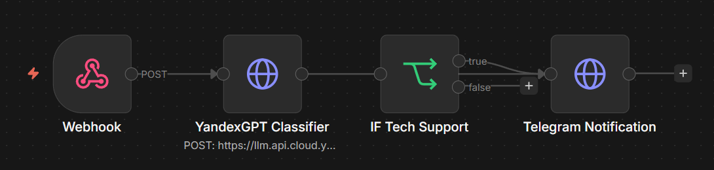
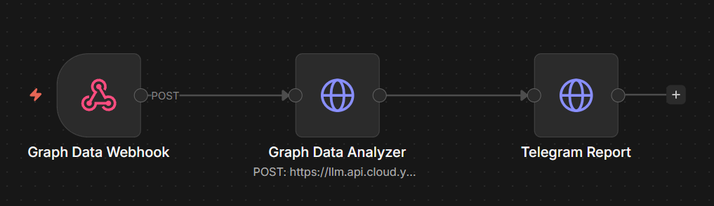
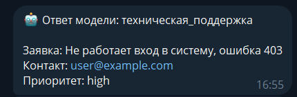
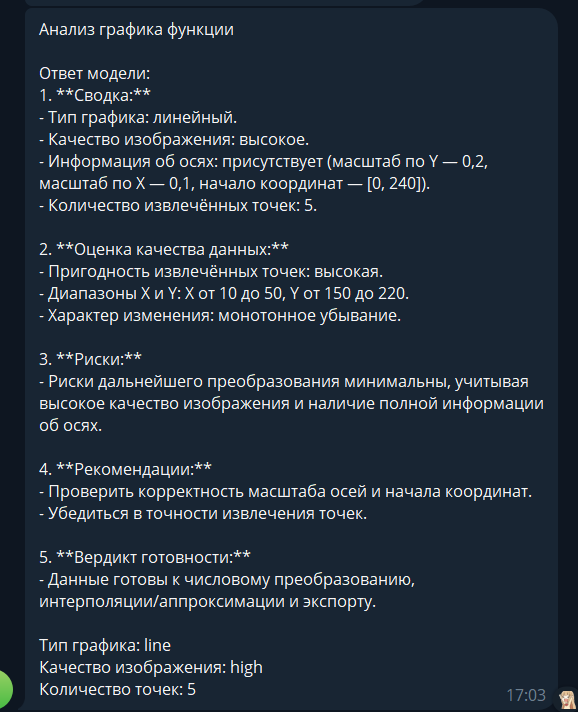
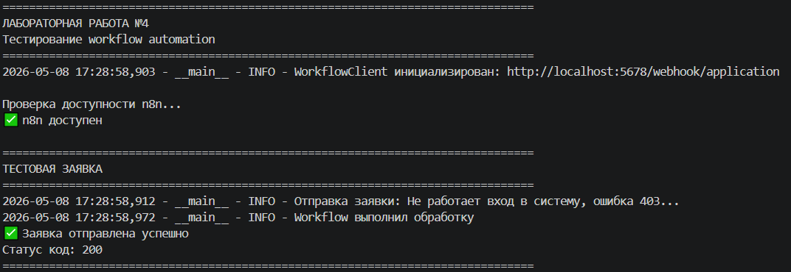
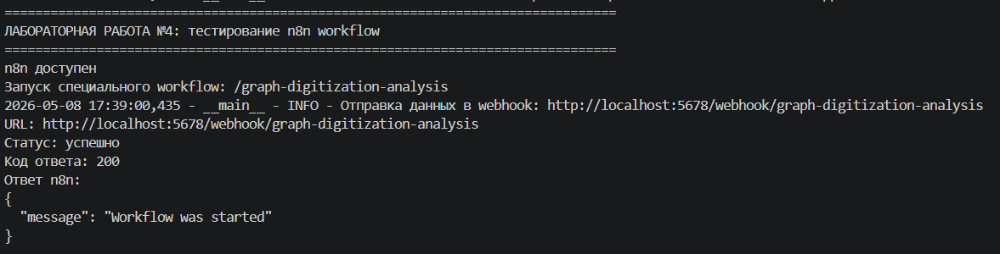

# Отчёт по лабораторной работе №4
## Дисциплина: Искусственный интеллект
---
## Общая информация
| Параметр | Значение |
|----------|----------|
| **Студент** | Жданов Никита Валерьевич |
| **Группа** | ФИТ-221 |
| **Дата выполнения** | 08.05.2026 |
| **Специальность** | Фундаментальная информатика и информационные технологии |
| **Тема диплома** | Информационная система по извлечению и преобразованию числовых данных с графиков функций |

---
## 1. Цель работы
Целью лабораторной работы являлось изучение принципов построения workflow-автоматизации на базе n8n и разработка цепочек обработки данных с интеграцией российской LLM-модели YandexGPT.

Дополнительной целью являлась адаптация одного из workflow под тему дипломной работы, связанную с извлечением и преобразованием числовых данных с графиков функций. В рамках этой адаптации был реализован сценарий, который принимает данные цифровизации графика, анализирует их пригодность к дальнейшему числовому преобразованию и отправляет результат анализа в Telegram.

---
## 2. Выполненные задачи
- [x] Развёрнута платформа автоматизации n8n в Docker.
- [x] Настроен `docker-compose.yml` для запуска n8n и хранения данных.
- [x] Создан базовый workflow для обработки заявок через webhook.
- [x] Интегрирован YandexGPT API через HTTP Request node.
- [x] Настроена отправка ответа модели в Telegram-бот.
- [x] Реализован Python-клиент `webhook_handler.py` для отправки данных в webhook.
- [x] Создан специализированный workflow под тему дипломной работы.
- [x] Проверена работа production webhook и test webhook.
- [x] Код лабораторной работы загружен в GitHub в ветку `week4`.

---
## 3. Ход работы
### 3.1. Настройка платформы n8n
Для реализации workflow-автоматизации была выбрана платформа n8n. Она позволяет строить цепочки обработки данных из отдельных узлов: webhook, HTTP-запросов, условий, интеграций с внешними API и сервисами уведомлений.

Платформа была развёрнута с помощью Docker Compose. Основной сервис `n8n` запускается на порту `5678`, а данные сохраняются в Docker volume, что позволяет не терять состояние workflow после перезапуска контейнера.

Файл конфигурации находится по пути:

```text
week4/docker/docker-compose.yml
```

В compose-конфигурации были настроены:
- проброс порта `5678:5678`;
- переменные окружения для Yandex Cloud;
- переменные окружения для Telegram-бота;
- разрешение доступа к env-переменным внутри n8n expressions;
- автоматический импорт workflow из каталога `week4/workflows`;
- публикация workflow после импорта.


### 3.2. Базовый workflow
Базовый workflow реализован в файле:

```text
week4/workflows/basic_workflow.json
```

Он предназначен для обработки входящих заявок. На вход поступает JSON с текстом заявки, контактной информацией и приоритетом. Workflow передаёт текст заявки в YandexGPT, получает результат классификации и отправляет ответ модели в Telegram.

Основная схема:

```text
Webhook -> YandexGPT Classifier -> Telegram Notification
```

Узел `Webhook` принимает HTTP POST-запросы по адресу:

```text
http://localhost:5678/webhook/application
```

Пример тела запроса:

```json
{
  "message": "Не работает вход в систему, ошибка 403",
  "contact": "user@example.com",
  "priority": "high"
}
```

Узел `YandexGPT Classifier` отправляет текст заявки в YandexGPT с системным промптом, который просит классифицировать обращение как одну из категорий:

```text
техническая_поддержка, продажа, вопрос, жалоба
```

Узел `Telegram Notification` отправляет в Telegram сообщение с ответом модели и исходными данными заявки.

Место для скриншота схемы базового workflow:



### 3.3. Интеграция с YandexGPT
Для интеграции с моделью используется HTTP-запрос к API Yandex Foundation Models:

```text
https://llm.api.cloud.yandex.net/foundationModels/v1/completion
```

В запрос передаются HTTP-заголовки:

```text
Content-Type: application/json
Authorization: Bearer <YANDEX_IAM_TOKEN>
x-folder-id: <YANDEX_FOLDER_ID>
```

Токены и идентификаторы не хранятся в workflow напрямую, а подставляются из переменных окружения:

```text
YANDEX_IAM_TOKEN
YANDEX_FOLDER_ID
```

В ходе работы была исправлена ошибка с `modelUri`: для YandexGPT используется lowercase-идентификатор модели:

```text
gpt://<folder_id>/yandexgpt/latest
```

Пример структуры запроса к модели:

```json
{
  "modelUri": "gpt://<folder_id>/yandexgpt/latest",
  "completionOptions": {
    "stream": false,
    "temperature": 0.3,
    "maxTokens": "200"
  },
  "messages": [
    {
      "role": "system",
      "text": "Классифицируй заявку как одну из категорий..."
    },
    {
      "role": "user",
      "text": "Не работает вход в систему, ошибка 403"
    }
  ]
}
```

Место для скриншота настройки AI-узла:



### 3.4. Интеграция с Telegram
Для отправки результата модели в Telegram используется HTTP Request node, который обращается к Telegram Bot API:

```text
https://api.telegram.org/bot<TG_BOT_TOKEN>/sendMessage
```

В `.env` используются переменные:

```text
TG_BOT_TOKEN
TG_CHAT_ID
```

В ходе настройки была обнаружена типичная ошибка: вместо chat id пользователя был указан id самого бота. Telegram API в таком случае возвращает ошибку:

```text
Forbidden: the bot can't send messages to the bot
```

Для исправления был получен настоящий chat id пользователя через метод `getUpdates`, после чего отправка сообщений начала работать корректно.

Место для скриншота сообщения в Telegram:



### 3.5. Python-клиент для webhook
Для взаимодействия с n8n из Python был реализован файл:

```text
week4/src/webhook_handler.py
```

В нём создан класс `WorkflowClient`, который:
- проверяет доступность n8n через `/healthz`;
- отправляет заявки в webhook `/webhook/application`;
- поддерживает отправку специализированных событий;
- формирует понятные сообщения об ошибках при недоступности workflow;
- нормализует URL и путь webhook, чтобы избежать обращения к пустому адресу `/webhook/`.

Пример использования клиента:

```python
client = WorkflowClient()
result = client.send_application(
    message="Не работает вход в систему, ошибка 403",
    contact="user@example.com",
    priority="high"
)
```




### 3.6. Специализированный workflow под диплом
Специализированный workflow реализован в файле:

```text
week4/workflows/spec_workflow.json
```

Он адаптирован под тему дипломной работы:

```text
Информационная система по извлечению и преобразованию числовых данных с графиков функций
```

Назначение workflow — анализ промежуточных результатов цифровизации графика функции. Он принимает данные о графике, извлечённых точках, качестве изображения и параметрах осей, затем передаёт их в YandexGPT для экспертной оценки.

Основная схема:

```text
Graph Data Webhook -> Graph Data Analyzer -> Telegram Report
```

Webhook доступен по адресу:

```text
http://localhost:5678/webhook/graph-digitization-analysis
```

Пример входных данных:

```json
{
  "task": "Оцени пригодность извлечённых точек графика функции к числовому преобразованию",
  "chart_type": "line",
  "image_quality": "high",
  "axis_info": {
    "x_scale": 0.1,
    "y_scale": 0.2,
    "origin": [0, 240]
  },
  "graph_points": [
    {"x": 10, "y": 220},
    {"x": 20, "y": 200},
    {"x": 30, "y": 185},
    {"x": 40, "y": 168},
    {"x": 50, "y": 150}
  ],
  "notes": "Точки получены после детекции линии функции на изображении графика."
}
```

Системный промпт специализированного workflow ориентирует модель на анализ:
- типа графика;
- качества изображения;
- наличия информации об осях;
- количества и пригодности извлечённых точек;
- диапазонов значений X и Y;
- характера изменения функции;
- рисков дальнейшего преобразования;
- готовности данных к интерполяции, аппроксимации и экспорту.

Ответ модели формируется как структурированный отчёт с разделами:

```text
1. Сводка
2. Оценка качества данных
3. Риски
4. Рекомендации
5. Вердикт готовности
```



### 3.7. Тестирование
Проверка доступности n8n выполнялась через endpoint:

```text
http://localhost:5678/healthz
```

Ожидаемый ответ:

```json
{"status":"ok"}
```

Для проверки базового workflow использовался POST-запрос:

```powershell
Invoke-RestMethod -Method Post `
  -Uri http://localhost:5678/webhook/application `
  -ContentType 'application/json' `
  -Body '{"message":"Не работает вход в систему, ошибка 403","contact":"user@example.com","priority":"high"}'
```

Для проверки специализированного workflow использовался POST-запрос:

```powershell
$body = @{
  task = 'Оцени пригодность извлечённых точек графика функции к числовому преобразованию'
  chart_type = 'line'
  image_quality = 'high'
  axis_info = @{ x_scale = 0.1; y_scale = 0.2; origin = @(0, 240) }
  graph_points = @(
    @{x=10;y=220},
    @{x=20;y=200},
    @{x=30;y=185},
    @{x=40;y=168},
    @{x=50;y=150}
  )
} | ConvertTo-Json -Depth 6

Invoke-RestMethod -Method Post `
  -Uri http://localhost:5678/webhook/graph-digitization-analysis `
  -ContentType 'application/json' `
  -Body $body
```

По результатам тестирования:
- n8n запускался и отвечал на `/healthz`;
- базовый workflow принимал заявку и отправлял результат в Telegram;
- специализированный workflow принимал данные о графике;
- YandexGPT формировал структурированный анализ;
- результат анализа отправлялся в Telegram;
- workflow завершался со статусом `success`.


### 3.8. Интеграция с дипломом
Разработанный специализированный workflow может использоваться как часть интеллектуального слоя дипломной системы. В предполагаемой архитектуре дипломного проекта модуль компьютерного зрения извлекает с изображения графика набор точек и параметры осей, после чего эти данные передаются в workflow для анализа качества.

Workflow помогает определить:
- достаточно ли точек извлечено для анализа функции;
- есть ли данные о шкалах и начале координат;
- пригоден ли набор точек для перехода от пиксельных координат к числовым значениям;
- какие риски могут повлиять на интерполяцию или аппроксимацию;
- какие шаги нужно выполнить перед экспортом данных.

Таким образом, workflow автоматизирует промежуточный контроль качества данных между этапом распознавания графика и этапом дальнейшего математического преобразования.

---
## 4. Результаты
| Критерий | Статус |
|----------|--------|
| Платформа n8n развёрнута | Выполнено |
| Docker Compose настроен | Выполнено |
| Базовый workflow создан | Выполнено |
| YandexGPT интегрирован | Выполнено |
| Telegram-уведомления работают | Выполнено |
| Python-клиент webhook реализован | Выполнено |
| Специализированный workflow под диплом создан | Выполнено |
| Workflow импортируются и публикуются автоматически | Выполнено |
| Код загружен в GitHub | Выполнено |

---
## 5. Выводы
В ходе лабораторной работы была изучена платформа n8n и реализованы workflow-сценарии для автоматизации обработки данных. Были настроены webhook-узлы, HTTP-запросы к YandexGPT и отправка результатов в Telegram.

Основной сложностью стала настройка взаимодействия между n8n, YandexGPT и Telegram.

Наиболее важным результатом стала адаптация workflow под тему дипломной работы. Специализированный сценарий позволяет автоматически анализировать данные, извлечённые с графиков функций, и формировать рекомендации по их дальнейшему числовому преобразованию. Такой подход может быть использован в дипломной системе как вспомогательный модуль контроля качества данных.

---
## 6. Список источников
1. Материалы дисциплины «Искусственный интеллект».
2. Документация n8n. URL: https://docs.n8n.io/
3. Документация Yandex Cloud Foundation Models. URL: https://yandex.cloud/ru/docs/foundation-models/
4. Документация Telegram Bot API. URL: https://core.telegram.org/bots/api
5. Документация Docker Compose. URL: https://docs.docker.com/compose/
