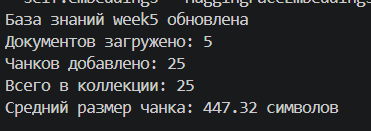
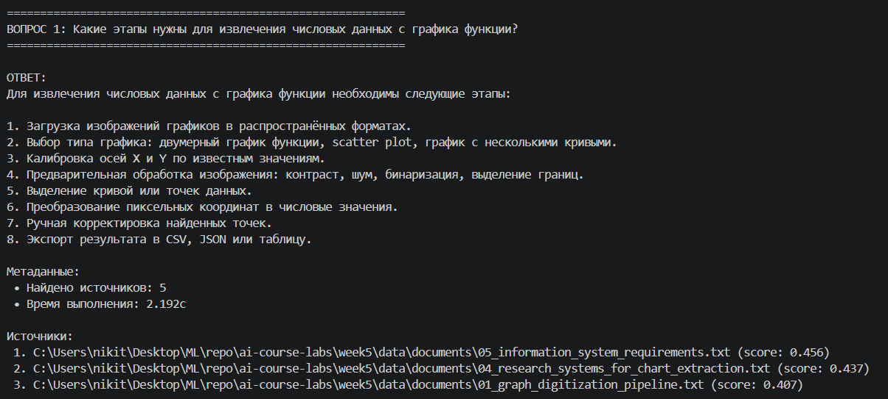
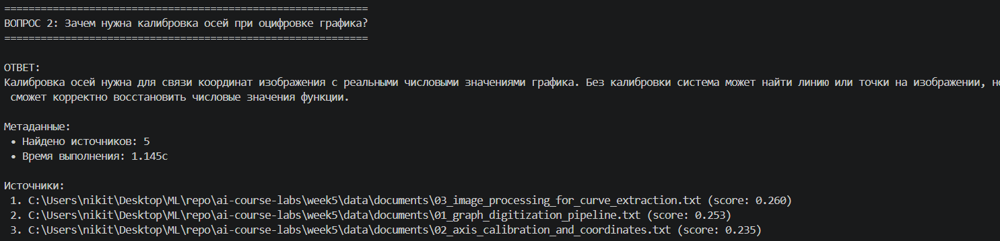
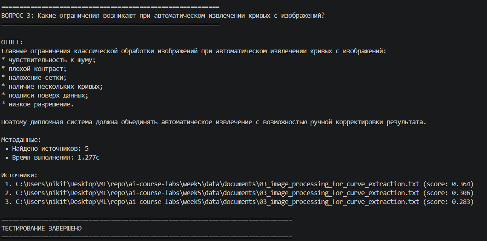

# Отчет по лабораторной работе №5

## Дисциплина: Искусственный интеллект

---

## Общая информация

| Параметр | Значение |
|---|---|
| **Студент** | Жданов Никита Валерьевич |
| **Группа** | ФИТ-221 |
| **Дата выполнения** | 08.05.2026 |
| **Тема диплома** | Информационная система по извлечению и преобразованию числовых данных с графиков функций |

---

## 1. Цель работы

Цель лабораторной работы — разработать RAG-систему, которая использует подготовленную базу знаний по теме диплома и отвечает на вопросы о методах извлечения числовых данных с изображений графиков функций.

В рамках работы была создана база документов о калибровке осей, обработке изображений, извлечении кривых, научных подходах к анализу графиков и требованиях к информационной системе. На основе этой базы реализован пайплайн: загрузка документов, разбиение на фрагменты, построение векторного индекса, поиск релевантного контекста и генерация ответа.

---

## 2. Выполненные задачи

- [x] Подготовлены документы для предметной базы знаний по теме диплома.
- [x] Реализована загрузка документов из папки `week5/data/documents`.
- [x] Настроено разбиение текстов на чанки.
- [x] Настроено векторное хранилище ChromaDB.
- [x] Реализован RAG-пайплайн для поиска контекста и формирования ответа.
- [x] Добавлен доменный промпт для темы извлечения данных с графиков функций.
- [x] Добавлена отдельная команда индексации базы знаний.
- [x] Исключены из Git локальные данные ChromaDB и файл `.env`.
- [x] Код загружен в GitHub в ветку `week5`.

---

## 3. Ход работы

### 3.1. Архитектура RAG-системы

Архитектура решения состоит из следующих этапов:

1. Пользовательские и справочные документы помещаются в папку `week5/data/documents`.
2. `DocumentLoader` загружает документы форматов TXT, MD, PDF и DOCX.
3. `ChunkingStrategy` разбивает документы на фрагменты фиксированного размера с перекрытием.
4. `VectorStoreManager` строит embeddings и сохраняет их в ChromaDB.
5. `RAGPipeline` принимает вопрос пользователя и ищет релевантные фрагменты в базе знаний.
6. Найденный контекст передается в LLM через доменный промпт.
7. Пользователь получает ответ с источниками и метаданными.


### 3.2. Настроенные компоненты

| Компонент | Реализация | Параметры |
|---|---|---|
| Загрузка документов | `DocumentLoader` | Поддерживаемые форматы: `.pdf`, `.txt`, `.md`, `.docx` |
| Разбиение текста | `ChunkingStrategy` | Стратегия: `recursive`, размер чанка: 700, перекрытие: 100 |
| Embeddings | `HuggingFaceEmbeddings` | Модель: `sentence-transformers/paraphrase-multilingual-MiniLM-L12-v2`, размерность: 384 |
| Векторное хранилище | ChromaDB | Папка: `week5/data/chroma_db`, коллекция: `rag_documents` |
| LLM | YandexGPT | Использует `YANDEX_IAM_TOKEN` и `YANDEX_FOLDER_ID` из `.env` |
| Доменный промпт | `DOMAIN_RAG_PROMPT` | Ограничивает ответы темой диплома и найденным контекстом |


### 3.3. Документы для индексации

В базу знаний добавлены следующие документы:

| Файл | Содержание |
|---|---|
| `01_graph_digitization_pipeline.txt` | Общий конвейер извлечения числовых данных с графиков функций |
| `02_axis_calibration_and_coordinates.txt` | Калибровка осей и преобразование пиксельных координат в числовые значения |
| `03_image_processing_for_curve_extraction.txt` | Методы обработки изображений, поиск осей, сетки и кривых |
| `04_research_systems_for_chart_extraction.txt` | Обзор подходов ChartSense, Scatteract и ChartLine |
| `05_information_system_requirements.txt` | Функциональные и нефункциональные требования к дипломной системе |

Документы подготовлены в виде кратких русскоязычных конспектов на основе открытых источников. Такой формат удобен для индексации: тексты достаточно компактные, тематически сфокусированные и не содержат лишнего оформления.


### 3.4. Индексация базы знаний

Для индексации добавлен отдельный файл:

```powershell
.\venv\Scripts\python.exe week5\src\index_knowledge_base.py
```

При запуске выполняются следующие действия:

1. Загружается `.env` из папки `week5`.
2. Читаются документы из `week5/data/documents`.
3. Документы разбиваются на чанки.
4. Коллекция `rag_documents` очищается, чтобы не создавать дубликаты.
5. Новые чанки добавляются в ChromaDB.
6. В консоль выводится статистика индексации.

Для добавления документов без очистки коллекции можно использовать параметр:

```powershell
.\venv\Scripts\python.exe week5\src\index_knowledge_base.py --append
```




### 3.5. Тестовые запросы

В `rag_pipeline.py` подготовлены тестовые вопросы по теме диплома:

| № | Запрос | Ожидаемый смысл ответа |
|---|---|---|
| 1 | Какие этапы нужны для извлечения числовых данных с графика функции? | Описание конвейера: загрузка, обработка, калибровка, извлечение кривой, экспорт |
| 2 | Зачем нужна калибровка осей при оцифровке графика? | Объяснение преобразования пиксельных координат в реальные значения X и Y |
| 3 | Какие ограничения возникают при автоматическом извлечении кривых с изображений? | Перечень проблем: шум, сетка, несколько кривых, низкое разрешение, подписи поверх данных |

Команда запуска RAG-пайплайна:

```powershell
.\venv\Scripts\python.exe week5\src\rag\rag_pipeline.py
```






### 3.6. Адаптация под тему диплома

Изначально RAG-пайплайн был универсальным и содержал тестовые вопросы про искусственный интеллект, RAG и векторные базы данных. В ходе адаптации он был привязан к теме диплома:

- заменены тестовые вопросы на вопросы о графиках функций;
- добавлен доменный промпт для ответов только по найденному контексту;
- подготовлены документы об извлечении данных с графиков;
- добавлены материалы о калибровке осей, обработке изображений и ограничениях автоматического распознавания;
- реализована отдельная команда индексации базы знаний;
- пути к документам и базе ChromaDB привязаны к папке `week5`, чтобы запуск не зависел от текущей директории терминала.

RAG-компонент может использоваться как справочный модуль дипломной системы. Например, он может объяснять пользователю, почему нужна калибровка осей, какие параметры обработки выбрать и почему результат извлечения может быть неточным.

### 3.7. Возникшие проблемы и решения

В основном были проблемы с подготовкой документов.

---

## 4. Результаты

| Критерий | Статус |
|---|---|
| Предметная база знаний подготовлена | Выполнено |
| Документы адаптированы под тему диплома | Выполнено |
| Индексация через отдельный скрипт реализована | Выполнено |
| RAG-пайплайн адаптирован под тему диплома | Выполнено |
| Пути запуска стабилизированы | Выполнено |
| `.env` и ChromaDB исключены из Git | Выполнено |
| Код загружен на GitHub в ветку `week5` | Выполнено |


---

## 5. Выводы

В ходе лабораторной работы была разработана RAG-система, ориентированная на тему диплома. База знаний содержит сведения о процессе оцифровки графиков функций, калибровке осей, обработке изображений и требованиях к информационной системе.

Полученный RAG-пайплайн позволяет находить релевантные фрагменты документов и формировать ответы по предметной области. Такая система может быть полезна в дипломном проекте как справочный модуль, который помогает пользователю понимать этапы обработки графика, ограничения автоматического распознавания и причины возможных ошибок.

Основной практический результат — подготовлена структура, которую можно расширять новыми документами, алгоритмами обработки изображений и пользовательским интерфейсом для работы с графиками.

---

## 6. Список источников

1. WebPlotDigitizer Documentation. URL: https://automeris.io/docs/digitize/
2. PlotDigitizer Documentation. URL: https://plotdigitizer.com/docs
3. OpenCV Documentation: Hough Line Transform. URL: https://docs.opencv.org/4.x/d9/db0/tutorial_hough_lines.html
4. Microsoft Research: ChartSense: Interactive Data Extraction from Chart Images. URL: https://www.microsoft.com/en-us/research/publication/chartsense-interactive-data-extraction-chart-images/
5. Scatteract: Automated Extraction of Data from Scatter Plots. URL: https://arxiv.org/abs/1704.06687
6. ChartLine: Automatic Detection and Tracing of Curves in Scientific Line Charts. URL: https://www.mdpi.com/1424-8220/24/21/7015
