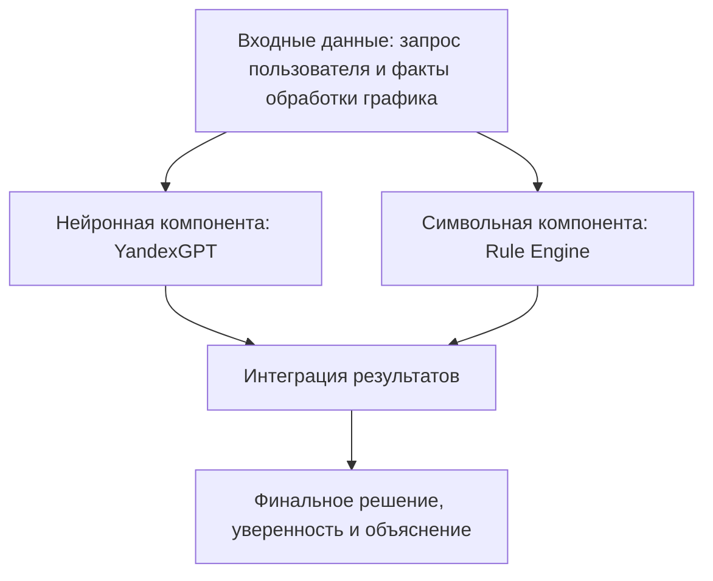
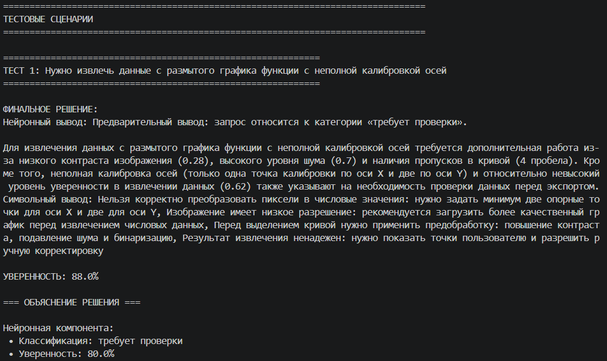
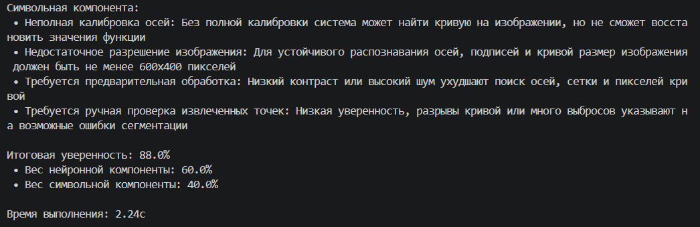
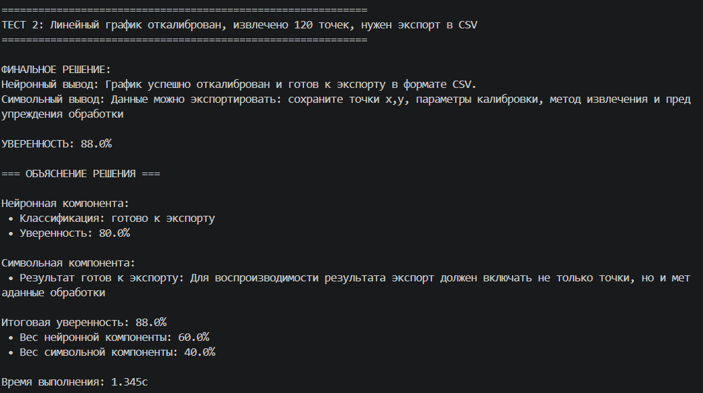
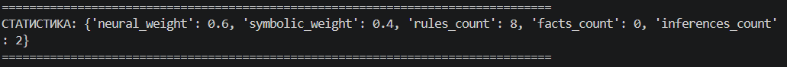

# Отчёт по лабораторной работе №6
## Дисциплина: Искусственный интеллект

---

## Общая информация

| Параметр | Значение |
|----------|----------|
| **Студент** | Жданов Никита Валерьевич |
| **Группа** | ФИТ-221 |
| **Дата выполнения** | 09.05.2026 |
| **Специальность** | Фундаментальная ифнорматика и информационные технологии |
| **Тема диплома** | Информационная система по извлечению и преобразованию числовых данных с графиков функций |

---

## 1. Цель работы

Цель лабораторной работы — разработать нейро-символьный прототип, который объединяет возможности LLM и формального логического вывода. Система должна анализировать состояние обработки изображения графика функции, применять предметные правила и формировать объяснимый итоговый вывод для пользователя.

В рамках дипломной темы такой подход полезен для контроля качества процесса оцифровки графиков: от загрузки изображения и калибровки осей до проверки извлечённых точек и экспорта результата.

---

## 2. Выполненные задачи

- [x] Реализован Rule Engine для логического вывода на основе правил.
- [x] Интегрирован LLM-клиент для YandexGPT.
- [x] Создан гибридный нейро-символьный пайплайн.
- [x] Разработано 8 правил, релевантных теме диплома.
- [x] Выполнена адаптация под предметную область извлечения числовых данных с графиков функций.
- [x] Проверена работа YandexGPT после исправления URI модели.
- [x] Код загружен в GitHub, ветка `week6`.

---

## 3. Ход работы

### 3.1. Архитектура системы

Нейро-символьная система построена как последовательный пайплайн:

Входными данными являются текстовый запрос и набор фактов. Например: размер изображения, уровень шума, контрастность, количество точек калибровки, число найденных кривых, уверенность извлечения и выбранный формат экспорта.

Нейронная компонента выполняет классификацию ситуации и формирует предварительный текстовый вывод. Символьная компонента применяет формальные правила к фактам. Затем результаты объединяются с весами: 60% для нейронной компоненты и 40% для символьной.

### 3.2. Реализованные компоненты

| Компонент | Файл | Назначение |
|-----------|------|------------|
| Rule Engine | `src/symbolic/rule_engine.py` | Хранение правил, проверка условий, формирование выводов и объяснений |
| Graph Rules | `src/symbolic/rules.py` | Набор предметных правил для оцифровки графиков функций |
| Knowledge Base | `src/symbolic/knowledge_base.py` | Хранение фактов и простых троек знаний |
| LLM Client | `src/neural/llm_client.py` | Обращение к YandexGPT API, генерация и классификация |
| Pipeline | `src/neuro_symbolic/pipeline.py` | Объединение LLM-вывода и символьного вывода |
| Report | `docs/report.md` | Документирование результата лабораторной работы |

### 3.3. Разработанные правила

| ID | Название | Приоритет | Условие | Вывод |
|----|----------|-----------|---------|-------|
| `IMG_LOW_RESOLUTION` | Недостаточное разрешение изображения | HIGH | Ширина меньше 600 px или высота меньше 400 px | Рекомендуется загрузить более качественный график |
| `IMG_PREPROCESSING_REQUIRED` | Требуется предварительная обработка | HIGH | Низкий контраст или высокий уровень шума | Нужно применить повышение контраста, подавление шума и бинаризацию |
| `CALIBRATION_INCOMPLETE` | Неполная калибровка осей | CRITICAL | Меньше двух опорных точек по X или Y | Нельзя корректно преобразовать пиксели в числовые значения |
| `CALIBRATION_POINTS_TOO_CLOSE` | Опорные точки расположены слишком близко | MEDIUM | Расстояние между калибровочными точками меньше 120 px | Нужно выбрать более удалённые деления шкалы |
| `LOG_SCALE_CONFIRMATION_REQUIRED` | Нужно подтвердить логарифмическую шкалу | HIGH | Обнаружен или выбран логарифмический масштаб, но он не подтверждён | Нужно подтвердить тип шкалы перед преобразованием координат |
| `MULTIPLE_CURVES_SELECTION_REQUIRED` | Не выбрана кривая при наличии нескольких серий | HIGH | Найдено несколько кривых, но целевая серия не выбрана | Пользователь должен выбрать нужную серию данных |
| `EXTRACTION_REVIEW_REQUIRED` | Требуется ручная проверка точек | MEDIUM | Низкая уверенность, разрывы кривой или много выбросов | Нужно показать точки пользователю и разрешить корректировку |
| `EXPORT_READY` | Результат готов к экспорту | LOW | Калибровка выполнена, точек достаточно, уверенность высокая | Данные можно экспортировать вместе с метаданными |

### 3.4. Тестовые сценарии

| № | Входные данные | Нейронный вывод | Символьный вывод | Итог |
|---|----------------|-----------------|------------------|------|
| 1 | Размытый график, размер 480x320, низкий контраст, высокий шум, неполная калибровка, низкая уверенность извлечения | `требует проверки` | Сработали `CALIBRATION_INCOMPLETE`, `IMG_LOW_RESOLUTION`, `IMG_PREPROCESSING_REQUIRED`, `EXTRACTION_REVIEW_REQUIRED` | Экспорт блокируется, пользователю нужно улучшить изображение, завершить калибровку и проверить точки |
| 2 | Линейный график 1280x720, калибровка выполнена, извлечено 120 точек, уверенность 0.91, формат CSV | `готово к экспорту` | Сработало `EXPORT_READY` | Данные можно экспортировать в CSV вместе с параметрами обработки |
| 3 | График с несколькими кривыми, целевая серия не выбрана | `требует проверки` | Сработало `MULTIPLE_CURVES_SELECTION_REQUIRED` | Перед экспортом пользователь должен выбрать нужную кривую |
| 4 | График с логарифмической шкалой без подтверждения пользователя | `требует проверки` | Сработало `LOG_SCALE_CONFIRMATION_REQUIRED` | Необходимо подтвердить тип шкалы, иначе координаты будут преобразованы неверно |

### 3.5. Адаптация под специальность и тему диплома

Лабораторная работа адаптирована под тему диплома: **информационная система по извлечению и преобразованию числовых данных с графиков функций**.

В предметной области оцифровки графиков недостаточно просто найти линию или точки на изображении. Система должна понимать, можно ли доверять результату: достаточно ли качественное изображение, выполнена ли калибровка, корректно ли учтён тип шкалы, не смешаны ли несколько кривых, можно ли экспортировать полученные точки.

Разработанные правила закрывают ключевые этапы такого конвейера:

1. Проверка качества изображения.
2. Предварительная обработка перед выделением кривой.
3. Калибровка осей X и Y.
4. Учёт линейного или логарифмического масштаба.
5. Работа с несколькими кривыми на одном графике.
6. Проверка качества извлечённых точек.
7. Экспорт результата в CSV/JSON/XLSX.

Таким образом, нейро-символьный подход помогает сделать дипломную систему более объяснимой: LLM формирует гибкое текстовое заключение, а правила дают строгие проверяемые причины для предупреждений и блокировок.

### 3.6. Объяснимость решений

Система возвращает не только финальное решение, но и список сработавших правил. Например, для плохого изображения с неполной калибровкой объяснение включает следующие причины:

- калибровка неполная, поэтому пиксели нельзя корректно перевести в числовые значения;
- разрешение изображения ниже минимального порога;
- низкий контраст и высокий шум ухудшают выделение осей и кривой;
- низкая уверенность извлечения требует ручной проверки.

Такой формат полезен для пользователя дипломной системы: он видит, какие параметры обработки нужно исправить, и понимает, почему система не разрешает экспорт или помечает результат как ненадёжный.

---

## 4. Результаты

| Критерий | Статус |
|----------|--------|
| Пайплайн запускается | Выполнено |
| Rule Engine работает | Выполнено |
| Разработано не менее 5 правил | Выполнено, реализовано 8 правил |
| Правила адаптированы под тему диплома | Выполнено |
| YandexGPT интегрирован | Выполнено |
| Исправлен URI модели YandexGPT | Выполнено |
| Выполнена проверка классификации через YandexGPT | Выполнено |
| Код загружен в GitHub | Выполнено, ветка `week6` |

Проверка YandexGPT показала, что после исправления `model_uri` на `gpt://<folder_id>/yandexgpt/latest` клиент успешно выполняет генерацию и классификацию. Для тестового сценария с размытым графиком модель вернула категорию `требует проверки`, а символьная часть указала конкретные причины: неполная калибровка, низкое разрешение, необходимость предобработки и ручной проверки точек.

---

## 5. Выводы

В ходе лабораторной работы был реализован гибридный нейро-символьный прототип. Основной результат — система, которая сочетает гибкость LLM с формальными правилами предметной области.

Для дипломной темы такой подход особенно полезен, потому что извлечение числовых данных с графиков функций требует не только автоматического распознавания, но и контроля корректности каждого этапа. Символьные правила позволяют явно фиксировать ограничения: минимальное качество изображения, полноту калибровки, необходимость выбора кривой, подтверждение логарифмической шкалы и готовность результата к экспорту.

Трудности возникли при подключении YandexGPT: первоначально API возвращал ошибку `invalid model_uri`. Ошибка была исправлена заменой `yandexGPT` на `yandexgpt` в URI модели. Также была доработана загрузка `.env` и запуск `pipeline.py` напрямую, чтобы проект работал не только при запуске как модуль, но и при запуске файла из консоли.

В дальнейшем систему можно расширить: добавить реальные алгоритмы компьютерного зрения, интеграцию с OCR для подписей осей, сохранение истории обработки, визуальный интерфейс ручной корректировки точек и автоматическое формирование отчёта о качестве оцифровки.

---

## 6. Список источников

1. Yandex Cloud Documentation. Foundation Models Text Generation API. URL: https://yandex.cloud/en/docs/ai-studio/text-generation/api-ref/TextGeneration/completion
2. Yandex Cloud Documentation. Available YandexGPT models. URL: https://yandex.cloud/en/docs/foundation-models/concepts/yandexgpt/models
3. WebPlotDigitizer Documentation. URL: https://automeris.io/docs/digitize/
4. PlotDigitizer Documentation. URL: https://plotdigitizer.com/docs
5. GraphExpert Professional Documentation. URL: https://www.curveexpert.net/docs/graphexpert/pro/pdf/GraphExpertProfessional.pdf
6. OpenCV Documentation. Hough Line Transform. URL: https://docs.opencv.org/4.x/d9/db0/tutorial_hough_lines.html
7. ChartSense: Interactive Data Extraction from Chart Images. Microsoft Research. URL: https://www.microsoft.com/en-us/research/publication/chartsense-interactive-data-extraction-chart-images/
8. Scatteract: Automated Extraction of Data from Scatter Plots. arXiv. URL: https://arxiv.org/abs/1704.06687
9. ChartLine: Automatic Detection and Tracing of Curves in Scientific Line Charts. Sensors, 2024. URL: https://www.mdpi.com/1424-8220/24/21/7015
